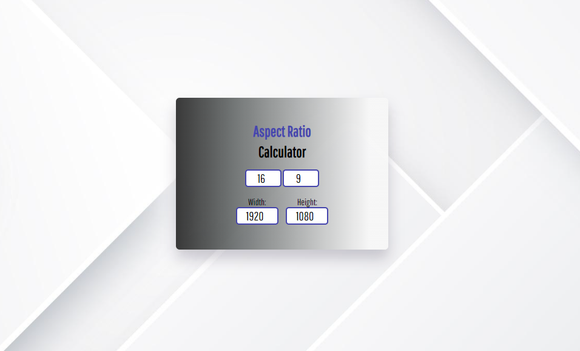
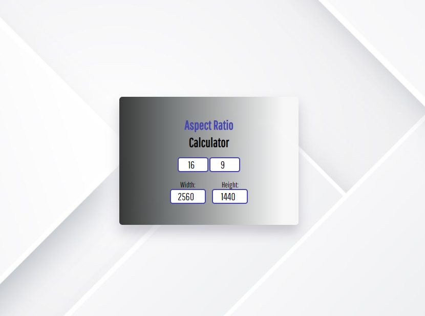
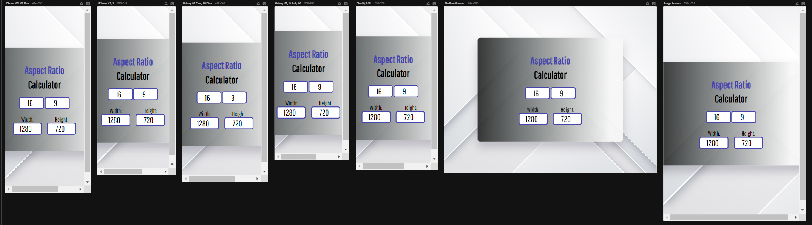

# Aspect Ratio Calculator

This is an appreciated javascript project demonstrating a resolution calculation for monitors

## Table of contents

- [Overview](#overview)
  - [The challenge](#the-challenge)
  - [Screenshot](#screenshot)
  - [Links](#links)
- [My process](#my-process)
  - [Built with](#built-with)
  - [What I learned](#what-i-learned)
- [Author](#author)

## Overview

### The challenge

Users should be able to:

- Automated calculation within the website
- Unique design specially made for the calculation card

### Screenshot






### Links

- Repository URL: [Click Here](https://github.com/CBrandsDev/Aspect-Ratio-Calculator)
- Live Site URL: [Click Here](https://cbrandsdev.github.io/Four-Card-Feature-Section/)

## My process

### Built with

- Semantic HTML5 markup
- CSS custom properties
- Flexbox
- CSS Grid
- Script in JS


### What I learned

In this challenge I managed to understand how the interactive elements work using hover in the css, I also managed to implement some shadows in the layout of the information box, which makes a good impression at first glance. 
I used media settings to set different settings for different mobile devices
I also demonstrated a little javascript, although simple because it was my first code using js I was very happy with the result

```css
.card {
box-shadow: rgba(0, 0, 0, 0.3) 0px 19px 38px, rgba(0, 0, 0, 0.22) 0px 15px 12px;
}
```
```js
let ratioWidth = document.getElementById("ratio-width");
let ratioHeight = document.getElementById("ratio-height");
let width = document.getElementById("width");
let height = document.getElementById("height");
```
```css
@media screen and (max-width: 688px) {
    .container {
        display: flex;
        flex-direction: column;
        align-items: center;
        justify-content: center;
        padding-top: 1100px;
    }
    .attribution{
        opacity: 0;
    }
```


## Author

- Github - [@CbrandsDev](https://github.com/CBrandsDev)
- Linkedin - [Calil Brandão](https://www.linkedin.com/in/calil-brand%C3%A3o/)
- Twitter - [@onlythecalil](https://twitter.com/onlythecalil)

